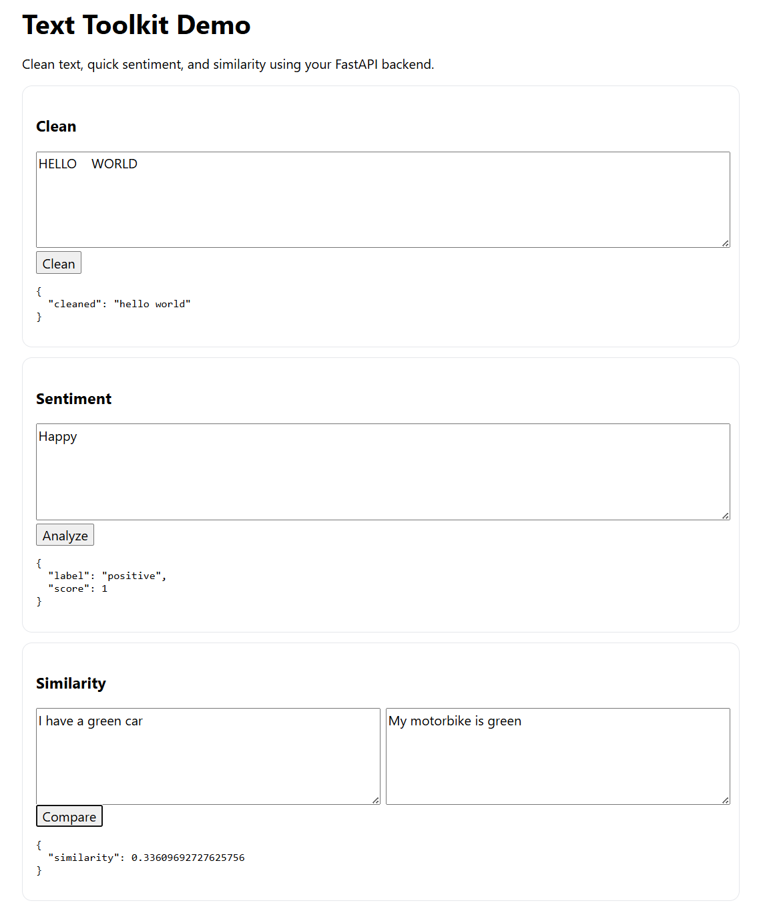

# Text Toolkit API 🚀

A simple **FastAPI-based microservice** for text cleaning, sentiment analysis, and similarity — with a lightweight frontend on GitHub Pages.

## 🌐 Live Demo

- **API Docs (Swagger UI):** [https://text-toolkit-api.onrender.com/docs](https://text-toolkit-api.onrender.com/docs)  
- **Frontend UI (GitHub Pages):** [https://roryMansell.github.io/text-toolkit-api/](https://roryMansell.github.io/text-toolkit-api/)

---

## 📸 Screenshot




---

## ✨ Features
- **/clean** → lowercases + trims text.  
- **/sentiment** → returns positive/negative sentiment (HuggingFace).  
- **/similarity** → cosine similarity between two texts.  
- Auto-generated API docs at `/docs`.  
- Frontend with simple HTML/JS for quick testing.  

---

## 🛠️ Tech Stack
- **FastAPI** + Uvicorn + Gunicorn  
- **scikit-learn**, **numpy**  
- **Transformers** (optional for real sentiment model)  
- **GitHub Actions** (CI with pytest + black)  
- **Render** (API hosting)  
- **GitHub Pages** (frontend hosting)  

---

## 🧑‍💻 Usage

### Run locally
```bash
# create environment
conda create -n text-toolkit python=3.11
conda activate text-toolkit

# install deps
pip install -r requirements.txt

# run dev server
uvicorn app.main:app --reload
# open http://127.0.0.1:8000/docs
